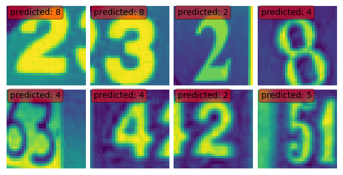
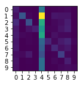
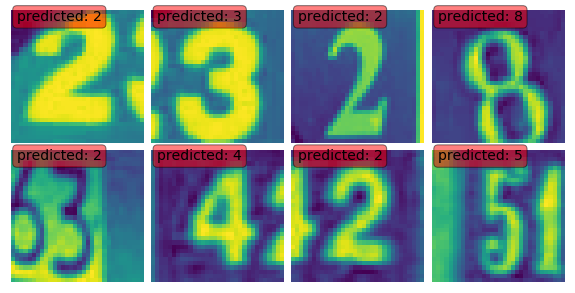
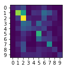

# Unsupervised domain adaptation
## MNIST to SVHN

### by backpropagation

#### Usual LeNet model:

             precision    recall  f1-score   support

        0.0       0.12      0.15      0.14      4948
        1.0       0.81      0.18      0.29     13861
        2.0       0.56      0.21      0.31     10585
        3.0       0.80      0.09      0.16      8497
        4.0       0.13      0.74      0.22      7458
        5.0       0.74      0.14      0.24      6882
        6.0       0.35      0.19      0.24      5727
        7.0       0.37      0.31      0.34      5595
        8.0       0.15      0.16      0.15      5045
        9.0       0.33      0.04      0.07      4659

    avg / total       0.50      0.23      0.23     73257

#### LeNet with DA:

             precision    recall  f1-score   support

        0.0       0.41      0.09      0.15      4948
        1.0       0.51      0.34      0.41     13861
        2.0       0.30      0.53      0.38     10585
        3.0       0.30      0.20      0.24      8497
        4.0       0.25      0.14      0.18      7458
        5.0       0.31      0.53      0.40      6882
        6.0       0.12      0.18      0.14      5727
        7.0       0.32      0.48      0.39      5595
        8.0       0.26      0.17      0.21      5045
        9.0       0.39      0.18      0.25      4659

    avg / total       0.33      0.31      0.30     73257

